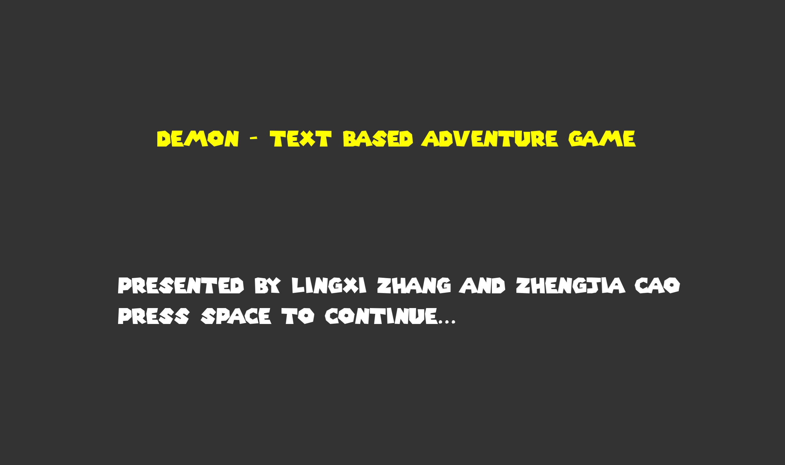

# Demon: A text based adventure

Author: Lingxi Zhang, Zhengjia Cao

Design: A text based adventure game with novel plot written by the authors.

Text Drawing: 

The text drawing in this game is implemented by the text drawing pipeline in the `textgenerator.hpp` and `textgenerator.cpp`. The graphics code for actual text display is in `PlayMode::draw` function.

Screen Shot:

How To Play:

Use the `w` and `s` key to make the choices. Confirm your choice with `SPACE` and proceed with the plot.

Sources: 

- Fonts: 
1. https://www.dafont.com/super-mario-256.font
- BGM:
1. https://www.fesliyanstudios.com/royalty-free-music/downloads-c/8-bit-music/6

This game was built with [NEST](NEST.md).

